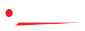

# ORKAY TILES - Brand Guidelines

---

## Brand Overview

**Company Name:** Orkay Tiles  
**Established:** 1996  
**Location:** Morbi, Gujarat, India  
**Tagline:** "From Walls to Beyond"

**About:** Orkay Tiles is a leading manufacturer and exporter of Ceramic Wall Tiles, Digital Porcelain Tiles, Glazed Vitrified Tiles & Double Charged Vitrified Tiles with a global presence in 40+ countries.

---

## Logo Assets

### Primary Logo


**Usage:** Use on white or light backgrounds

### Red Logo


**Usage:** Use as an accent or brand marker

### White Logo



**Usage:** Use on dark or colored backgrounds

### Favicon


**Usage:** Browser tab icon, app icons

---

## Color Palette

### Primary Colors

| Color Name | Hex Code | RGB | Usage |
|------------|----------|-----|-------|
| **Orkay Red** | `#FC424A` | rgb(252, 66, 74) | Primary brand color, CTAs, accents |
| **Black** | `#000000` | rgb(0, 0, 0) | Headlines, strong emphasis |
| **White** | `#FFFFFF` | rgb(255, 255, 255) | Backgrounds, text on dark |

### Secondary Colors

| Color Name | Hex Code | RGB | Usage |
|------------|----------|-----|-------|
| **Title Text** | `#25252B` | rgb(37, 37, 43) | Headings, titles |
| **Body Text** | `#5C5C60` | rgb(92, 92, 96) | Body copy, paragraphs |
| **Light Gray** | `#D3D3D3` | rgb(211, 211, 211) | Borders, dividers |

### Color CSS Variables

```css
:root {
    --red: #fc424a;
    --body: #5c5c60;
    --title: #25252b;
    --black: #000;
    --white: #fff;
    --gray: #d3d3d3;
}
```

---

## Typography

### Primary Typeface

**Font Family:** Helvetica Now Display

| Style | Weight | Usage |
|-------|--------|-------|
| Regular | 400 | Body text, paragraphs |
| Medium | 500 | Buttons, navigation, emphasis |
| Bold | 700 | Headings, titles |

### Heading Sizes

| Element | Size (Desktop) | Line Height |
|---------|----------------|-------------|
| H1 | 54px | 1.4 |
| H2 | 42px | 1.4 |
| Body | 18px | 1.7 |

### Font Stack

```css
body {
    font-family: 'Helvetica Now Display', system-ui, -apple-system, "Segoe UI", Roboto, "Helvetica Neue", Arial, sans-serif;
    font-size: 18px;
    font-weight: 400;
    color: var(--body);
    line-height: 1.7;
}

h1, h2, h3, h4, h5, h6 {
    font-family: 'Helvetica Now Display', sans-serif;
    font-weight: 700;
    color: var(--title);
    line-height: 1.4;
}
```

---

## Button Styles

### Primary Button (Theme)

```css
.btn-theme {
    color: var(--white);
    background: var(--red);
    border: 1px solid var(--red);
    font-weight: 500;
    padding: 15px 30px;
    border-radius: 100px;
}
```

### Secondary Button (Black)

```css
.btn-black {
    color: var(--white);
    background: var(--body);
    border: 1px solid var(--body);
}
```

---

## UI Components

### Custom Scrollbar

```css
::-webkit-scrollbar {
    width: 8px;
}
::-webkit-scrollbar-track {
    background: var(--body);
}
::-webkit-scrollbar-thumb {
    background: var(--red);
}
```

### Form Inputs

```css
input, .form-control {
    font-size: 18px;
    height: 50px;
    padding: 12px 20px;
    color: var(--black);
    background-color: var(--white);
    border: 1px solid var(--gray);
    border-radius: 10px;
}
```

---

## Social Media

- **Facebook:** <https://www.facebook.com/orkaytiles>
- **LinkedIn:** <https://www.linkedin.com/company/orkay-tiles/>
- **Instagram:** <https://www.instagram.com/orkay_tiles/>
- **YouTube:** <https://www.youtube.com/@orkaytiles>

---

## Contact Information

**Corporate Office:**  
62/63/64, Shakti Chember-1  
8A National Highway, Morbi-363642  
Gujarat, INDIA

**Phone:**

- +91 98256 00183
- +91 99246 54222

**Email:** <info@orkaytiles.com>

**Website:** <https://orkaytiles.com>

---

## Mission & Vision

### Mission

Orkay Tiles pushes boundaries in tile design while upholding rigorous quality standards that exceed expectations. To globally define our products as standard for quality and excellence.

### Vision

Orkay Tiles aspires to be globally admired for our commitment to innovation, customer satisfaction and integrity in everything we do. The creation of ceramic surfaces that combine high technical and aesthetic performances with a modern and contemporary design.

---

*Brand Bible v1.0 | Generated from orkaytiles.com | January 2026*
